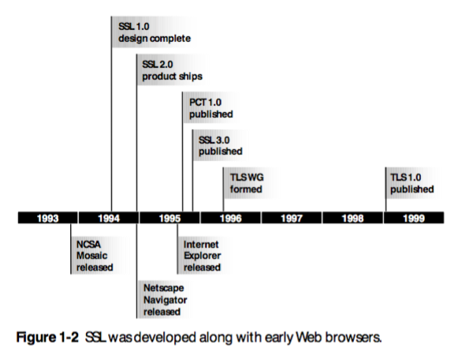

## History

Early pioneers of the internet were already considering ways to secure the Web.
In particular, _Netscape Communications_ began security implementations while
developing its first browser. At the time, an attacker could eavesdrop
on communications, compromise message integrity, or impersonate servers if they
surreptitiously stood between a client and server. This man-in-the-middle attack
was a concern for early browser developers and protocol developers. To mitigate
this attack, _Netscape Communications_ developed the *Secure Sockets Layer* (SSL) and
embedded it into its most popular browsers, *Netscape Mosiac* and *Netscape Navigator*.
The chart below shows its integration with other well-known browsers. 

In November 1994, Netscape completed the design for SSL version 1.0. But
version 1.0 was never publicly released because it had serious security flaws
in the protocol. Only few months later in February 1995, much improved ssl
protocol was released as SSL version 2.0. SSL version 2.0 also contained
a number of security issues which ultimately led to the design of SSL version
3.0. SSL version 3.0 was released in 1996 by Netscape and Paul Kocher with
complete redesign of the protocol and it eliminates lot of security flaws in
previous versions. Newer versions of SSL/TLS are based on SSL 3.0.

Although Netscape owned the patent for SSL, its development was open and
involved other industry professionals. Eventually, SSL's development would be
the responsibility of the _Internet Engineering Task Force_ and to avoid biases
towards Netscape, renamed their version to *Transport Layer Security* (TLS).
Despite change in names, TLS is just a new version of SSL. Actually there are
far fewer differences between TLS 1.0 and SSL 3.0 than there are between SSL
3.0 and SSL 2.0. TLS 1.0 includes a means by which its implementation can
downgrade the connection to SSL 3.0 and thus weakening security.

SSL/TLS have been through many different versions in their history and it is
important to understand how this protocol has evolved and changed over the
years.

