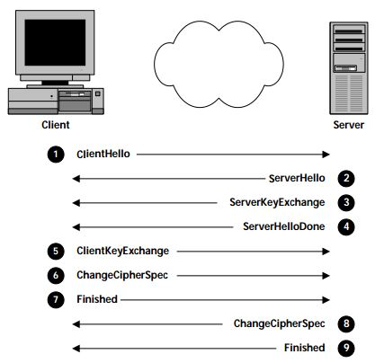
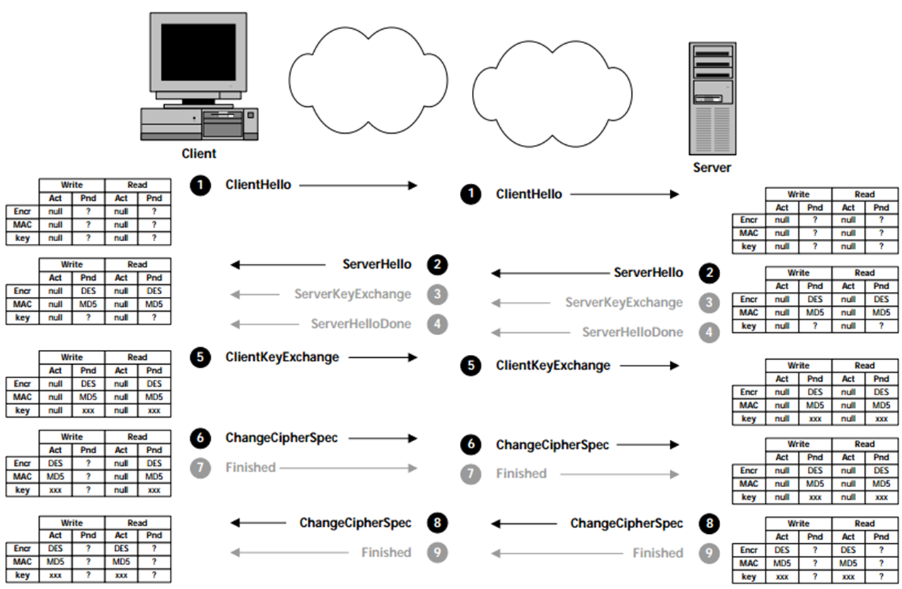
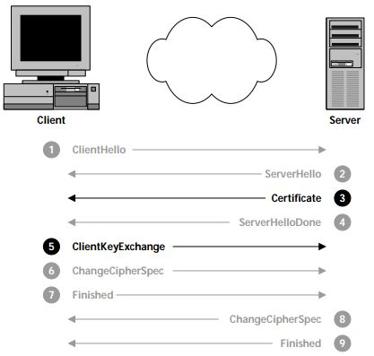

## SSL Overview

 Establishing Secure Communication
----

  The Secure Sockets Layer protocol operates between a client, most commonly a web browser, and a server, most commonly a website, that communicate with each other through ssl messages.  
The most basic function is to establish a channel for encrypted communication.  This occurs when the client sends a ClientHello message to the server which includes its proposed SSL options.  The server then responds with a ServerHello message containing its selected SSL options, then a ServerKeyExchange message with its public key information.  The client can now send its session key that has been encrypted with the server's public key via a ClientKeyExchange message, activates the negotiated options for future messages via a ChangeCipherSpec message, and lets the server check the options via a Finished message.  The server then finishes the setup with its own ChangeCipherSpec and Finished messages.  

  The initial ClientHello message mentioned in the previous paragraph is made of several fields.  The version field contains the highest supported version of the SSL protocol.  The current and most widely used version is 3.0.  A client or server may accept using a lower version to communicate with a less updated system, or may terminate the connection.  The RandomNumber field contains a random number for use in the critical cryptographical calculation.  4 of the 32 bits of this field are recommended to consist the date and time, which helps protect against imposters or seeing the same random value twice, and the remaining 28 bits are a cryptographically secure random value.  The SessionID message is left empty in the case of ClientHello messages, since the session has not yet been established.  The CipherSuites field lists various cryptographic services supported by the client.  This includes exact algorithms and key sizes.  The server then decides which services to use for the established communication.  The CompressionMethosds field is similar to the prior, but contains the data compression methods.  It is important that both sides of the communication compress any information before encrypting it in order to avoid security issues.  
  
  The response ServerHello message is almost identical to the ClientHello.  All fields of the message are the same, with the exception of CipherSuite and CompressionMethod being singular.  The version, CipherSuite and CompressionMethod fields determine the settings that will be used by both the client and server in all further communication from the options given by the client.  
  
  Next the server follows up with a ServerKeyExchange message containing the public key information, which is formatted differently depending on the algorithm being implemented.  This is transmitted without encryption so should only contain the public key information, which the client then uses to encrypt a session key.  A follow up ServerHelloDone message lets the client know the server has completed negotiation messages.  
  
  The client is now able to respond with a ClientKeyExchange message containing the client's key information for the symmetric encryption algorithm.  This key has been encrypted using the public key of the server, to protect against the message being intercepted.  At this point in the communication, the client and server can begin using the security services they negotiated in the previous messages.  
  
  
  
  The ChangeCipherSpec message is a very important message in the protocol to explicitly indicate the security services should now be invoked.  This message is sent by both the client and server once they know all information needed for the secure communication and the system then activates its write state.  Upon receiving a ChangeCipherSpec from its peer, it activates its read state.  The elements of a state are the encryption algorithm, message integrity algorithm, and key material.  All systems start in an active state with no security services.  As messages begin, systems enter the pending state, which is built by the above messages.  When receiving ChangeCipherSpec messages, it changes its active read state to pending read state, and when sending, it changes its pending write state to active write state.
  
  Both systems follow their ChangeCipherSpec messages with a Finished message, which allows both systems to verify the negotiation was successful and security has not been compromised.  The receiving party being unable to decrypt and verify the message means some error has occurred.  It also includes exact content of all handshake messages to protect against an attacker inserting fictitious messages or removing genuine ones.  
  
  The defined procedure for terminating a connection is rarely used due to the nature of web sessions.  In the procedure, both client and server transmit a ClosureAlert message.  This protects against truncation attacks where the attacker prematurely terminates a communication that could keep complete messages from arriving.  
  
 Authentication
----
 
  It is possible that a third party could intercept all encryption information and attempt to masqueradeas the intended recipient of a message.  To combat this, ssl allows each party to authenticate the other's identity.  Because websites typically do not need to check the identity of the web browser, typically only server authentication is used.  In this procedure, the server will transmit a Certificate message containing it's public key certificate instead of the ServerKeyExchange message after transmitting it's ServerHello message to the client.  
  
  
  
  The Certificate message simply contains a certificate chain beginning with the server's public key certificate and ending with the certificate authority's root certificate.  The Client must then decide if it can trust the certificate by verifying the signiture, validity times and revocation status.  It also determines if the certificate authority is trustworthy by knowing the public key of the trusted certificate authorities in advance.  These can be obtained in a few ways; for example, Netscape and Microsoft preload public keys for well-known certificate authorities into its browser software.  
||||||| merged common ancestors

### TLS Overview

Going into TLS in depth

Version field for TLS in the ClientHello message is 3.1 instead of 3.0.  
