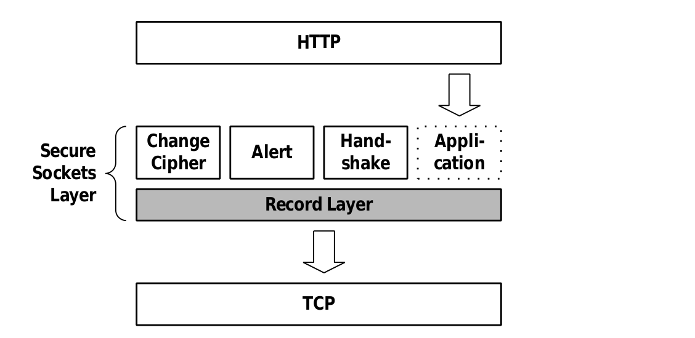
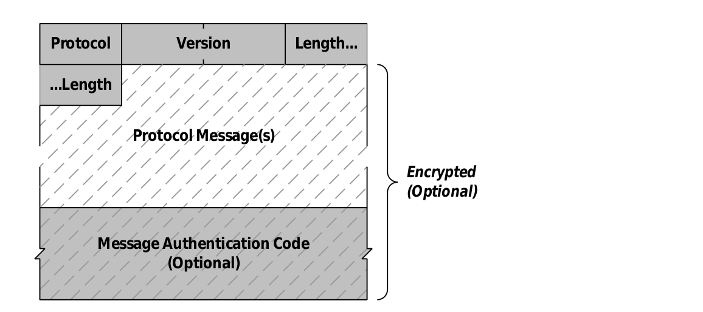
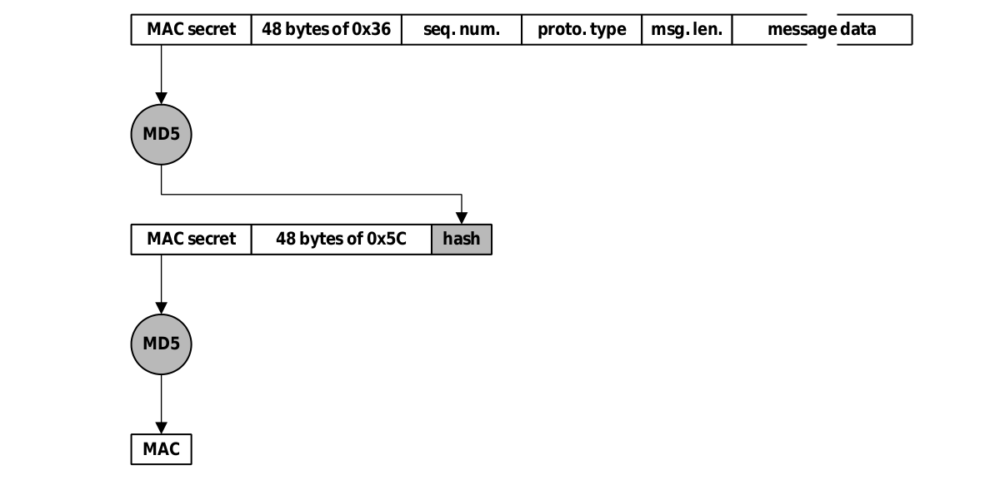
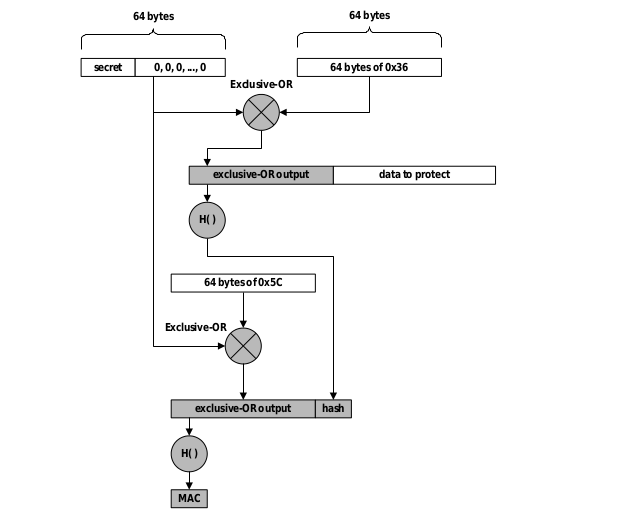
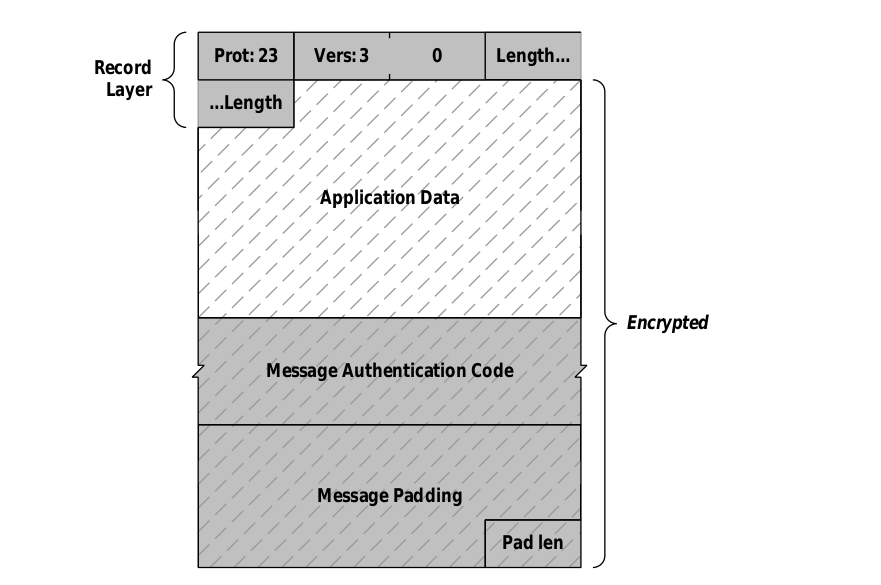
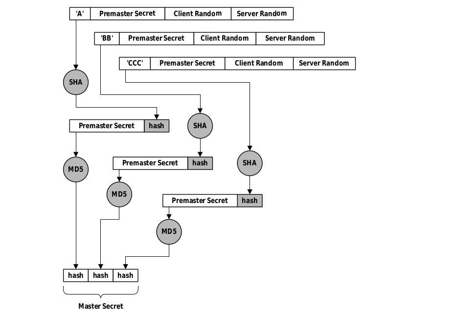
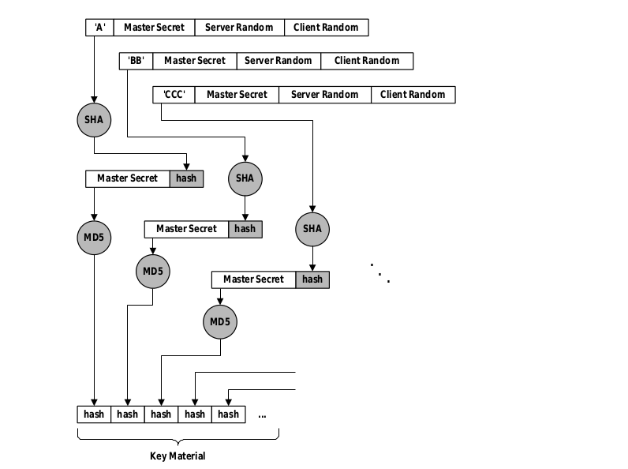
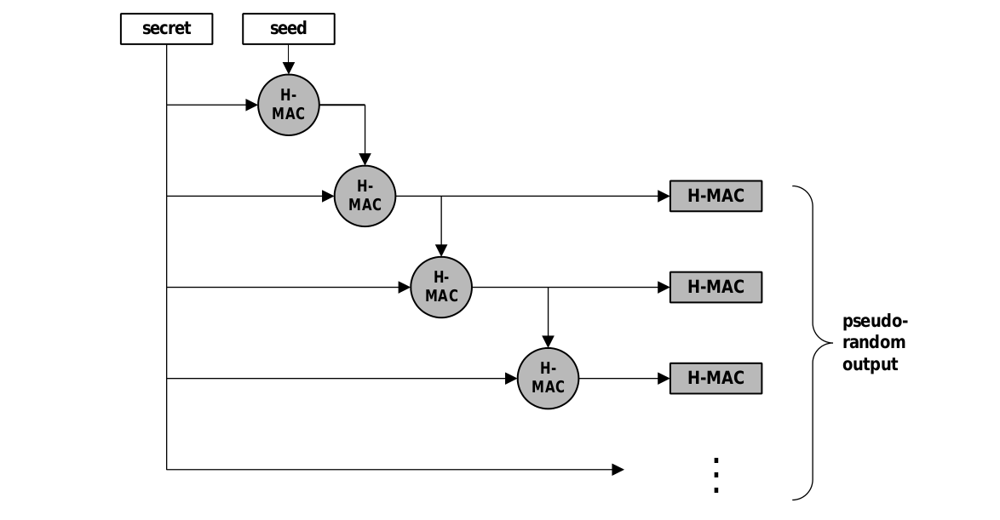
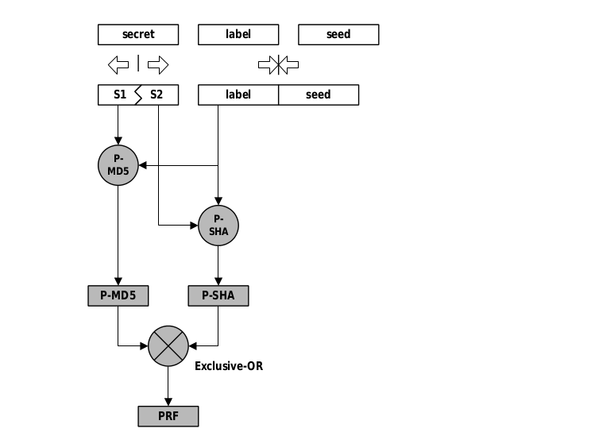
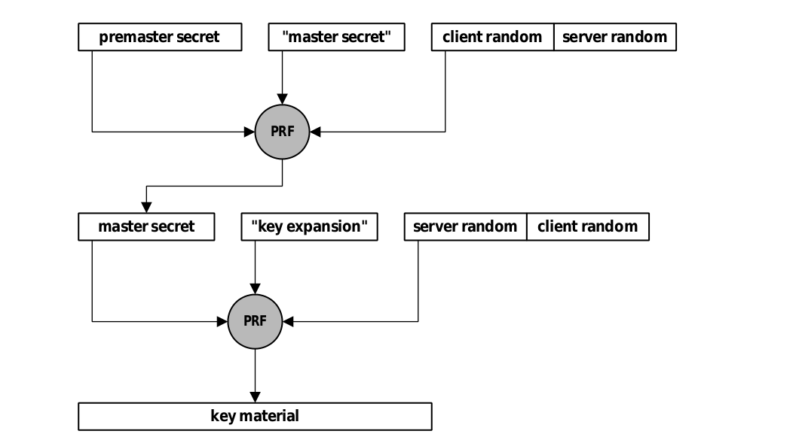

## Messages
### Record Layer
SSL uses its _Record Layer Protocol_ to encapsulate all messages. It provides common format to frame Alert, ChangeCipherSpec, Handshake and application protocol messages. The Record Layer fomatting consists of 5 bytes that precede other protocol messages and message authentication code at the end of the message if message integrity is active. Record layer also encrypts if encryption service is active. The two figures below shows Record layer position and the structure of Record layer formatting.

 

__SSL Record Layer Fields__

Protocol: Its size is 1 byte. It indicates which higher layer protocol is contained in this SSL Record Layer messages.

Version: Its size is 2 bytes. Version specification of SSL. Current SSL version is 3.0 and if it is TLS, then it uses 3.1 version value.

Length: Its size is 2 bytes. It indicates the length of the following higher layer protocol messages as a 16 bit binary number. The SSL specification requires the value not exceed 2^14^.

Protocol messages: Its size is variable but not higher than 2^14^ (16384) bytes. The messages is of higher layer protocol messages including message authentication code. The Record layer may concatenate multiple higher layer messages into a single Record layer message but those messages must belong to the same higher layer protocol. Messages can be from ChangeCipherSpec protocol, Alert protocol, Handshake protocol and Application protocol data.

### ChangeCipherSpec Protocol 
ChangeCipherSpec protocol has only one message which is the ChangeCipherSpec message. Even though it has only one message, SSL treats ChangeCipherSpec as separate protocol. The SSL protocol applies security services such as encryption to entire Record Layer messages at once. The ChangeCipherSpec message indicates a change in the services. Since encryption cannot be applied to parts of a message, it is impossible for any other message to follow a ChangeCipherSpec message within a Record Layer message. To make it simple, ChangeCipherSpec is defined as a separate protocol. The entire message is encapsulated in a Record Layer message. For ChangeCipherSpec message, the Record Layer has a protocol type value is 20, a protocol version of 3.0 for SSL or 3.1 for TLS and length of 1. The ChangeCipherSpec message itself consists only of a single byte. It has the value of 1.

### Alert Protocol
Systems use the Alert protocol to signal an error or caution condition to the other party in their communication. SSL assigns its protocol type value of 21. It also uses the Record Layer to format its messages. The Alert protocol itself defines two fields, a severity level and an alert description. Severity level indicates the severity of the condition that caused the alert. It can be warnings with severity level 1 or fatal alert of severity level 2. Severity level 2 represents significant problems eith the communication and needs both parties to terminate the session immediately. In case of severity level 1, a system may decide to allow to continue present session but requires both parties to invalidate the SSL session for any future connections. The second field is alert description field and it describes the specific error in more detail. The field is a single byte. The following are the list of values and their meaning used in SSL.

0 (CloseNotify) : the sending party indicates eplicitly that it is closing the connection; closure alerts have a warning severity level.

10 (UnexpectedMessage) : The sending party indicates that it received an improper message; this alert is always fatal.

20 (BadRecordMAC) : The sending party indicates that its has received a message for which the message authentication code failed; this alert is always fatal.

30 (DecompressionFailure) : The sending party indicates that it received data that it could not decompress; this alert is always fatal.

40 (HandShakeFailure) : The sending party indicates that it was not able to negotiate an acceptable set of security services for the session; this alert is always fatal.

41 (NoCertificate) : The sending party (which is always a client) indicates that it has no certificate that can satisfy the server’s CertificateRequest. 

42 (BadCertificate) : The sending party received a certificate that was corrupt (e.g. , its signature could not be verified).

43 (UnsupportedCertificate) : The sending party received a certificate of a type that it could not support.

44 (CertificateRevoked) : The sending party received a certificate that has been revoked by the certificate authority.

45 (CertificateExpired) : The sending party received a certificate tha has expired.

46 (CertificateUnknown) : The sending party indicates an unspecified problem with a certificate it received.

47 (IllegalParameter) : The sending party indicates that it received a handshake message with a parameter value that was illegal or inconsistent with other parameters.

### Securing Messages
__Message Authentication Code__

SSL uses message authentication code or MAC for data integrity. SSL supports two different algorithms for MAC. one is RSA's MD5 and another is SHA. Algorithm used is determined by cipher suite negotiated.
MD5 generates 16 byte hash value while sha creates 20 byte value. In both cases, the hash result is simply appended to application data. Both the application data and check value are encrypted.

The system uses two stage hash to calculate the message authentication code. It starts with a special value called the _mac write secret_, followed by padding, a 64-bit sequence number, a 16-bit value with the length of the content and finally, by the content itself. The padding is single byte value 00110110, repeated 48 times for MD5 and 40 times for SHA. For second stage, the system uses the mac write secret, padding and the output from first stage hash. The padding used is binary value 01011100, repeated 48 times for MD5 and 40 times for SHA. This two stage hash results in mac value. The two special values used in this calculation are mac write secret and sequence number. MAC write secret is discussed later on the report. The sequence number is a count of the number of messages the parties have exchanged and the value is reset during ChangeCipherSpec message and is incremented once for each SSL Record Layer message in the session.
The figure below shows the process for an MD5 MAC.

The algorithm used in TLS is different than this. TLS uses standard message authentication code known as H-MAC (Hashed message authentication code) instead of adhoc MAC. H-MAC doesn't specify any particular hash algorithm like MD5 or SHA; instead it works effectively with any competent hash algorithm. The mac is the result of H-MAC approach using any hash algorithm by negotiated cipher suite.
The figure below illustrates the process for MAC for TLS using H-MAC.

 The h-mac secret is the mac write secret derived from the master secret.

__Encryption__

SSL protocol supports both stream and block encryption ciphers. For stream encryption, information to be encrypted is simply application data followed by MAC and no other parameters are needed. But for block encryption, the data to be encrypted needs to be a multiple of the block size. And, since application data size varies, padding is used. Dummy data is added to the application data to force its length to be a multiple of the block size. Knowledge of end of application data and beginning of padding is required to successfully extract actual application data from encrypted information. SSL uses following message format for block encryption.

As shown in figure, the very last byte of the encrypted message information contains the length of the padding. After decrypting the block, a recipient counts backward from the padding length byte to find the end of application data.

__Creating cryptographic parameters__

The SSL encryption and MAC algorithms rely on a colleciton of secret information known only to the communicating parties. One of the major purposes of the SSL handshake is to establish that secret information securely. Master secret is beginning for all the shared secret information. The master secret is based on the premaster secret. The premaster secret is picked by the client generating a secure random number. The client encrypts this value using server's public key and sends it to the server in the ClientKeyExchange message. Once the server has received the ClientKeyExchange message, both parties know the same premaster secret. Each party takes premaster secret and random values each chose for its Hello message and secure hash it. Combining output of both hashes in specified ways, both parties will have same master secret.

Creating the premaster secret:

Actions taken depend on key exchange algorithm used.

RSA: Client generates the premaster secret as 2 bytes containing the SSL version (binary 3 and 0), followed by 46 securely generated fandom bytes.

Fortezza/DMS : Client generates the premaster secret as 48 securely generated random bytes.

Diffie-Hellman: The key created by the Diffie-Hellman computation (usually referred to as Z) is used as the premaster secret.

Calculating the master secret:

1. Caculate the SHA has of the ASCII character 'A' followed by the premaster secret, followed by the client's random value ( from the ClientHello), followed by the server's random value (from the ServerHello).

2. Calculate the MD5 hash of the permaster secret, followed by the output of step 1.

3. Calculate the SHA hash of the two ASCII characters 'BB' followed by the premaster secret, followed by the client's random value (from the CleintHello), followed by the server's random value (from the ServerHello).

4. Calculate the MD5 hash of the premaster secret followed by the output of step 3.

5. Concatenate the results from step 4 to those from step 2.

6. Calculate the SHA hash of the three ASCII characters 'CCC' followed by the premaster secret, followed by the client's random value (from the ClientHello), followed by the server's random value (from the the ServerHello).

7. Calculate the MD5 hash of the premaster secret, followed by the output of step 6.

8. Concatenate the results from step 7 to the results from step 5.

master secret = MD5(premaster secret + SHA('A' + premaster secret + ClientHello.random + ServerHello.random)) + MD5(premaster secret + SHA('BB' + premaster secret + ClientHello.random + ServerHello.random)) + MD5(premaster secret + SHA('CCC' + premaster secret + ClientHello.random + ServerHello.random))

The master secret requires six hash calculations.
The following figure depicts procedure of calculation of the master secret.

Once each system has calculated the master secret, it can generate actual secret information needed for the communication. And the first step in the process is to determine how much secret information is needed. The exact amount depends on the cipher suite and parameters that two parties have negotiated but generally consists of the information that are listed below.

Parameter and secret information

client write MAC secret : The secret value included in the message authentication code for messages generated by the client.

server write MAC secret : The secret value included in the message authentication code for messages generated by the server.

client write key        : The secret key used to encrypt messages generated by the client.

server write key        : The secret key used to encrypt messages generated by the server.

client write IV         : The initialization vector for encryption performed by the client.

server write IV         : The initialization vector for encryption performed by the server.

Each party selects from the list above the information according to the negotiated cipher suite, and then counts the number of bytes each value requires based on the negotiated cipher suite parameters. The result is required secret information.

Shared secret information is created in similar way used to create master secret. The following table shows the approach used to calculate key material.

Both parties first calculate the SHA hash of the ASCII character 'a' followed by the master secret, followed by the server's random value (from the ServerHello), followed by the client's random value (from the ClientHello). Then they calculate the MD5 hash of the master secret, followed by the results of the intermediate has. If the 16 byte hash generated by this is not sufficient for all the secret information, they repeat the process but with the ascii characters 'bb' instead of 'a'. The parties continute repeating this calculation (with 'CCC', then 'DDDD', then 'EEEEE' and so on) as many times as necessary to generate enough secret information. 

key material = MD5(master secret + SHA('A' + master secret + ClientHello.random + ServerHellow.random)) + MD5(master secret + SHA('BB' + master secret + ClientHello.random + ServerHello.random)) + MD5(master secret + SHA('CCC' + master secret + ClientHello.random + ServerHello.random)) + ...

Except for _exportable_ class of cipher suites, the values in the list above directly supply the secret information needed for the cryptographic computations. The exportable class of cipher suites uses smaller key sizes for encryption. For these cipher suites, the final secret key used for messages encrypted by the client is the MD5 hash of the client write key, followed by the server's random value and followed by the client's random value. Initialization vector are simply the MD5 hash of the client and server's random values (for the client write IV) or the server and client's random values (for the server write IV).

But it is to be noted that TLS uses completely new process for generating key material. TLS defines a procedure to create pseudorandom output using H-MAC standard. The procedure takes a secret value and initial seed value and securely generates random output. This procedure is able to produce as much random output as required. 

Creating intermediate pseudorandom output:

1. Calculate H-MAC of the secret and the seed.

2. Calculate H-MAC of the secret and the results of the previous step; the result is the first part of the pseudorandom output.

3. Calculate H-MAC of the secret and the results of the previous step; the result is the next part of the pseudorandom output.

4. Repeat step 3 as many times as required to product sufficient pseudorandom output.

TLS uses pseudorandom output procedure to further refine and create pseudorandom function or _prf_. prf combines two separate instances of pseudorandom output where one uses MD5 and another uses SHA hash algorithm. The tls standard specifies a function that uses both algorithms just in case one of the two is ever found to be insecure. It starts with a secret value, a seed value, and a label. As the figure below shows, the function splits the secret into two parts, one for the md5 hash and the other for the sha hash. It also combines the label and the seed into a single value. 

Pseudorandom function:

1. Split the secret into two equal parts; if the secret consists of an odd number of bytes, include the middle byte in each part. (It’s the last byte of the first part and the first byte of the second part.)

2. Generate pseudorandom output using the first part of the secret, the MD 5 hash function, and the combined label and seed.

3. Generate pseudorandom output using the second part of the secret, the SHA hash function, and the combined label and seed. 

4. Exclusive- OR the results from steps 2 and 3.

The principle of generating key material in TLS is similar to SSL but TLS relies on prf. Input values to the prf are the master secret (as the secret), the ASCII string “key expansion” (as the label), and the concatenation of the server’s random value and the client’s random value for the seed. The 48-byte master secret itself is also computed using the prf. The input values, in this case, are the premaster secret, the ASCII string “master secret” (as the label), and the concatenation of the client’s random value and the server’s random value. Following figure illustrates both steps in the process.

