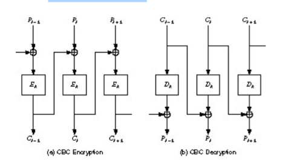

####Padding Oracle Attacks
To understand the POODLE attack, one must understand the nature of padding
oracle attacks.  Padding oracle attacks are a common attack performed using the
padding of a ciphertext.  Block ciphers encrypt a segmented chunk of data, or
block, at a time and adds interdependency by chaining these blocks together in
a particular order. The same is true of a vast majority of hash functions, which
operate on blocks of data at a time.  Often, ciphetexts lengths are not
a multiple of block sizes and must be padded to fit. 

Padding comes a variety of forms. Bit/Byte Padding adds a '1' to the end of the
ciphertext and follows that with as many '0's as necessary. For the ANSI X.923
standard, the padding fill the last block with '0's and the final byte
indicates the number of padded bytes. Finally, PCKS7 defined in [RFC
5652](http://tools.ietf.org/html/rfc5652#section-6.3) is similar to ANSI x.923
but but the value of the padded bytes is the number of bytes added.

```text
Bit Padding (1 byte)
... | 1011 1001 1101 0100 0010 011*1 0000 0000* |

ANSI x.923
... | DD DD DD DD DD DD *00 02* |

PKCS7
... | DD DD DD DD *04 04 04 04* |
```

A Padding Oracle Attack can occur when the server reveals knowledge of whether
the padding of an encrypted message is correct. The intent is to use the
mutability of the blocks to guess their correct plaintext values. Doing so can
allow an attacker to effectively decipher the plaintext without needing to
reverse the secret key. Using CBC as the block cipher mode of operation  we can
demonstrate an example attack. 

Suppose the victim is encrypting a message with AES and is using the Chain
Block Cipher (CBC) mode. The message consists of three plaintext blocks: `P1,
P2, & P3` and an Initialization Vector (`IV`) that are encrypted into three
ciphertext blocks: `C1, C2, & C3`. The attacker is fully aware of the
cryptography in use and knows the last block has been padded correctly.  

CBC encrypts and decrypts each block in a specific circuit. This can be shown
in the following figure:

$$
  Ci = EK(Pi \oplus Ci-1) = For Ciphertext Blocks
$$
$$
  Pi = Ci-1 \oplus DK(Ci) = For Plaintext Blocks 
$$



If an attacker changes the last byte in `C2` and the `IV,C1,C2, & C3` are sent
to the server, it will effect the entire block of P2 because of the 
avalanche effect of CBC's decryption. Also, the last byte of P3 will be
changed because C2 of the XORing operation from the previous block. The
server then checks the padding of the last block. This occurs before the
processing of the plaintext.

In this exploit, the attacker modifies the last byte by XORing it with the
padding and a guess. If the guess is correct, meaning the guessed value is the
correct text value in the plaintext, then the server will not raise a padding
error. Otherwise, the server will report an error in the padding and the
attacker can try another guess.  After the attacker knows the last byte, they
can continue to decipher the encrypted message by modifying the second to last byte 
in the ciphertext block and constructing a new guess with a new padding.
